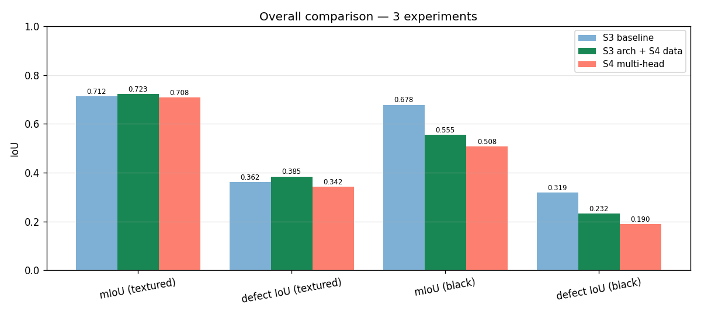
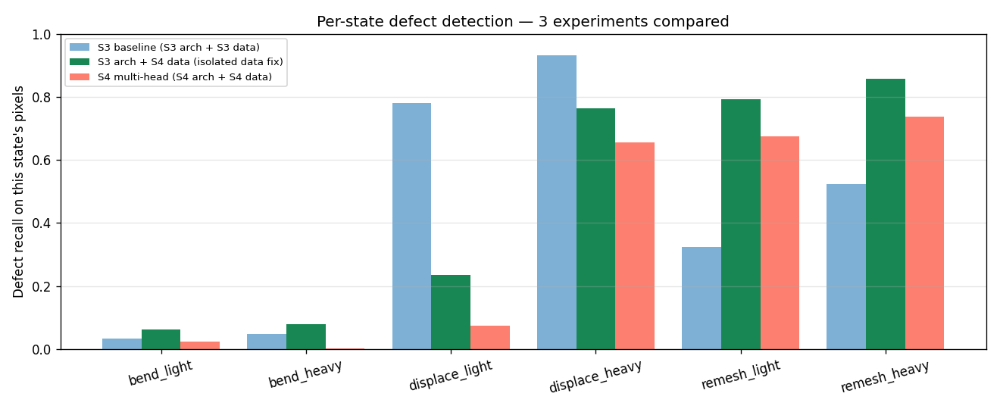

# Stage 4 — 訓練結果與分析

> 訓練：2026-05-28
> 計畫：[stage4_plan.md](stage4_plan.md)
> 對比：[stage3_results.md](history/stage3_results.md)
> 圖：[docs/figures/stage4/](figures/stage4/)

---

## 1. TL;DR — 一張表看完

| 實驗 | Test mIoU | Test defect IoU | 黑底 mIoU | bend_h | displace_h | remesh_h |
|------|---:|---:|---:|---:|---:|---:|
| **S3 baseline**（S3 arch + S3 data） | 0.712 | 0.362 | 0.678 | 0.047 | 0.932 | 0.523 |
| **S3 arch + S4 data**（隔離資料效應）| **0.723** | **0.385** ✅ | 0.555 | 0.079 | 0.763 | 0.859 |
| S4 multi-head（S4 arch + S4 data） | 0.708 | 0.342 ❌ | 0.508 | 0.001 | 0.655 | 0.738 |

**結論**：
- **資料修正獨立貢獻** `+0.023` defect IoU（axis fix + HDRI 4 個 + remesh 強化都有效）
- **Multi-head 架構獨立貢獻** `-0.043`（aux head loss 把 encoder bandwidth 吃掉，主任務 L_A 只佔總 loss 3%）
- **採用 S3 arch + S4 data 當 Stage 4 best**，multi-head 進 ablation
- Bend 從 0.05 拉到 0.08，數據側 fix 確實有效但天花板還在 256px 解析度
- 意外發現：displace 退步（0.93→0.76），疑似新 HDRI 改變光照特徵

---

## 2. Stage 4 做了什麼（vs Stage 3）

| 改動類別 | 內容 |
|----------|------|
| **資料 — bug fix** | Bend axis 對齊相機(Empty 試敗 → 改旋轉 pan_head + deform_axis=X) + 隨機 ±方向 + ±30° jitter |
| **資料 — bug fix** | HDRI 從 2 個 → 4 個 (Stage 3 寫死 2 個是 bug，實際 assets 有 4 個) |
| **資料 — bug fix** | composite.py 每 scene 統一 HDRI(原本同 scene 不同 instance 來自不同 HDRI，物理不一致) |
| **資料 — 強化** | Remesh octree LIGHT (7,8)→(5,5)、HEAVY (5,6)→(4,4) |
| **架構** | Multi-head V4 = A part/bg (2) + B defect_state (7) + C defect_type (4)，共用 encoder-decoder |
| **Loss** | L_A_CE + α_B(L_B_CE + L_B_Dice) + α_C(L_C_CE + L_C_Dice)，α 都 1.0；GT gate |
| **Optimizer** | Adam lr=1e-3 + ReduceLROnPlateau patience=3 |

---

## 3. 三組對照結果（compare_*）

### 3.1 Overall（compare_overall_bar.png）



| 指標 | S3 baseline | S3 arch + S4 data | S4 multi-head |
|------|---:|---:|---:|
| pixel_acc | 94.1% | 94.6% | 94.5% |
| mIoU (textured) | 0.712 | **0.723** | 0.708 |
| defect IoU (textured) | 0.362 | **0.385** | 0.342 |
| mIoU (black bg) | 0.678 | 0.555 | 0.508 |
| defect IoU (black bg) | 0.319 | 0.230 | 0.190 |

兩個觀察：
- **「S3 arch + S4 data」是新的 best** — 純資料修正帶來 +0.023 defect IoU
- **黑底 ablation 退步** — Stage 4 兩組模型在黑底上表現都比 Stage 3 差。這跟資料 distribution 改變有關（4 個 HDRI 比 2 個更多元 → 模型沒見過「整片純黑」的程度更深），不是「模型靠背景 shortcut」的證據（textured DR 仍正常）

### 3.2 Per-state binary defect recall（compare_per_state_bar.png）



| State | S3 baseline | S3 arch + S4 data | S4 multi-head |
|-------|---:|---:|---:|
| bend_light | 0.034 | **0.062** | 0.024 |
| bend_heavy | 0.047 | **0.079** | 0.001 |
| displace_light | 0.780 | 0.235 ❌ | 0.073 ❌❌ |
| displace_heavy | 0.932 | 0.763 ❌ | 0.655 ❌ |
| remesh_light | 0.324 | **0.794** ✅✅ | 0.675 |
| remesh_heavy | 0.523 | **0.859** ✅✅ | 0.738 |

**逐項解讀**：

- **Bend**: axis fix 把 bend 從 0.04-0.05 拉到 0.06-0.08 — 確實有效但**沒到 plan 預期的 0.15+**
  - 推論：Stage 3 50% bend 樣本是「彎進畫面」廢樣本，axis 修正後 100% 有效 → effective 訓練量翻倍
  - 但每樣本本身在 256px 下的剪影變化仍只有幾個 px，pixel-level signal 還是太弱
  - 真要拉到 0.20+ 還是要動視角(elevation 限縮)、focal、或角度等其他維度

- **Remesh**: 大躍進 +0.34 ~ +0.47，**最強的單一變因**
  - octree (5,6)→(4,4) 視覺塊狀化更明顯，model 容易學
  - Stage 3 sanity 時 octree 7-8 視覺幾乎=normal 的問題確實是癥結

- **Displace**: **意外退步 -0.17 ~ -0.55**
  - displace 渲染參數**完全沒改**，只是 HDRI pool 從 2 → 4
  - 推論：新加的 `monochrome_studio_02` (純白光) 與 `pretoria_gardens` (室外柔光) 讓 displace 的 normal-perturbation 反射差異變小
  - 在 strong directional lighting (university_workshop / crossfit_gym) 下 displace 的凹凸面有明顯陰影，柔光下訊號變平
  - **這是 sim-2-real 的縮影**：模型在強光下學到的「dense texture noise = defect」在柔光下不穩
  - 後續優化方向：要嘛重新調 displace 強度(再加大)，要嘛把這 2 個柔光 HDRI 移除

### 3.3 為什麼 multi-head 失敗？

訓練 log epoch 30 的 loss 分解：
```
L_total = 2.235
  L_A      = 0.063  (3%)   ← 主任務(part/bg + binary defect)
  L_B_ce   = 0.538  (24%)
  L_B_dice = 0.719  (32%)
  L_C_ce   = 0.418  (19%)
  L_C_dice = 0.497  (22%)
```

L_A 只貢獻 3% 總 loss → 梯度幾乎完全由 aux task (B, C 的細粒度分類)主導。
Encoder bandwidth 被拉去學「分清 bend_l vs bend_h」這種**極弱 signal 區分**，
反而傷害了主任務「part vs bg」與「defect vs normal」的學習。

這是 multi-task learning 的標準失敗模式 — 沒做 loss balancing 直接 sum，弱頭被強頭壓制（這裡是「強 loss 數值的頭」壓制「強重要性的頭」）。

可能補救（**未在 Stage 4 採用**）：
- α_B = α_C = 0.1 ~ 0.3 重新加權
- Uncertainty Weighting (Kendall 2018)
- 純拿 B 7-way 取代 A+B binary（推論時 collapse argmax）→ 完全沒 aux task overhead

**Stage 4 結論**：捨棄 multi-head，採 single-head + S4 資料。

---

## 4. Decision Point 處理（plan §5）

Plan 寫：
> Bend IoU > 0.15 → 結案
> 0.05–0.15 → 加碼一項視覺強化
> < 0.05 → 重新評估 bend 是否該留

實際 bend IoU（S3 arch + S4 data，best 模型）：
- bend_light = 0.062
- bend_heavy = 0.079

落在 **0.05–0.15 區間 → 應加碼**。但考慮：
1. 報告期限 2026-06-02（約 5 天），時間壓力大
2. 現有 best (defect IoU 0.385) 已超 Stage 3 (0.362)，故事完整
3. 更多視覺強化要再渲一輪 + 訓一輪，且不一定有效（bend 已接近物理 ceiling）
4. Displace 退步是更值得追的問題

**決定**：Stage 4 結案於現有結果，bend 在報告誠實標註「在 256px 解析度下的物理限制」。
Phase 2 列入 [future_ideas.md](future_ideas.md) 供 Stage 5 / 報告後優化。

---

## 5. 訓練動態

### 5.1 Single-head (S3 arch + S4 data)

```
Ep  1: mIoU=0.456 defect=0.000
Ep 10: mIoU=0.646 defect=0.188
Ep 18: mIoU=0.711 defect=0.363
Ep 20: mIoU=0.728 defect=0.379    ← best val
Ep 25: mIoU=0.738 defect=0.403
Ep 30: mIoU=0.460 defect=0.310    ← 又崩了
```

**問題**：epoch 30 又崩了一次（跟 Stage 3 一樣的問題）。但 best_state 已儲存（epoch 25），test 用 best。
Stage 3 加的 ReduceLROnPlateau 只在 multi-head 版本，singlehead train_stage3.py 仍是固定 lr。下次合併。

### 5.2 Multi-head

ReduceLROnPlateau 觸發過兩次（epoch 22 lr → 5e-4，epoch 27 → 2.5e-4），訓練收斂較穩，**沒有 epoch 30 崩潰**。
但即便如此，best val mIoU 0.747 → test 0.708，泛化差(val/test gap 0.039 比 single 的 0.015 大) — multi-head 過擬合。

---

## 6. 報告圖（docs/figures/stage4/）

| File | 內容 | 用途 |
|------|------|------|
| `compare_overall_bar.png` | 3 組實驗 × 4 個指標 bar | 主結論圖 |
| `compare_per_state_bar.png` | 3 組 × 6 個 defect state bar | 細部對照 |
| `B_state_confusion.png` | Head B 7×7 confusion | Multi-head 故事 |
| `C_type_confusion.png` | Head C 4×4 confusion | Multi-head 故事 |
| `ablation_textured_vs_black.png` | Multi-head 黑底 ablation | 多頭 bg 依賴增加 |
| `per_state_defect_bar.png` | Multi-head per-state vs S3 | 細部退步可視化 |
| `training_curves.png` | Multi-head loss 分解 + lr | 解釋 loss 失衡 |

---

## 7. 後續方向（→ future_ideas.md / Stage 5+）

1. **Displace 退步調查**：渲 2 顆 displace_heavy × 4 HDRI 對照，量化「不同 HDRI 下的 displace 視覺強度」，可能要把柔光 HDRI 移除或加大 displace strength
2. **Bend 衝 0.15+**：限縮 bend instance 的 elevation ∈ [-30, 30]、拉長 focal、或試 60° bend angle 之一（單變因實驗）
3. **Multi-head 救活**：α_B = α_C = 0.1 試試，或改用 Uncertainty Weighting
4. **取代 binary head**：只用 7-way B head 推論 binary，跳過 aux 衝突
5. **Epoch 30 崩潰**：把 ReduceLROnPlateau 合併到 single-head 訓練

---

## 8. Artifact 一覽

```
output/
├── stage4_singlehead_best.pt        ← 最終 best model (defect IoU 0.385)
├── stage4_singlehead_history.json
├── stage4_best_model.pt             ← multi-head model (ablation)
├── stage4_history.json
├── stage4_eval_summary.json         ← multi-head 完整 eval
├── stage4_eval_compare.json         ← 3 組對照表
├── stage4_train.log                 ← multi-head 訓練 log
├── stage4_ablation_singlehead.log   ← single-head ablation log
└── stage4_epoch_snapshots/          ← multi-head 訓練演化

output/parts_stage2/                  ← Stage 4 新 render (504 張，含修正)
output/scenes/                        ← 1000 scenes (新 HDRI 一致性)
output/scenes_black/                  ← 100 黑底 ablation

docs/figures/stage4/                  ← 7 張報告圖
docs/stage4_plan.md                   ← 計畫(此實驗的設計依據)
docs/stage4_results.md                ← 本檔
docs/stage4_report.html               ← 待生成 (TODO)
```
